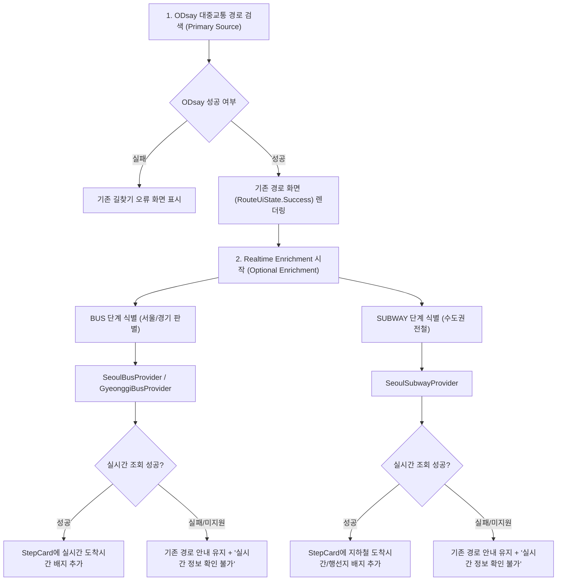

# 실시간 대중교통 정보 연동 최종 설계 및 구현 계획 (REALTIME_TRANSIT_PLAN)

> **문서 버전**: v1.0.0  
> **작성 일자**: 2026-08-25  
> **대상 프로젝트**: assesse/Odyssey (할머니 대중교통 길찾기 앱)  
> **기준 커밋**: `668fbd4e2e792b348a14ee9a5296311e08762a02`  

---

## 1. 사용자 확정 요구사항 요약 (/grill-me 결과)

| 항목 | 확정 내용 | 세부 정책 및 비고 |
| :--- | :--- | :--- |
| **서비스 대상 지역** | **서울특별시 + 경기도** | 서울 시내버스/마을버스, 경기 일반/직행/마을버스, 수도권 전철(1~9호선, 경의중앙, 수인분당, 신분당 등) |
| **대상 교통수단** | **버스 + 지하철 모두** | 경로에 포함된 `BUS` 단계와 `SUBWAY` 단계 모두에 실시간 도착 정보 연동 |
| **데이터 갱신 방식** | **최초 1회 자동 조회 + [🔄 새로고침]** | 경로 화면 진입 시 1회 자동 로드, 이후 상단/카드 내 수동 새로고침 버튼으로 갱신 (API 할당량 보호 및 배터리 절약) |
| **인증키 관리** | **[보호자 설정] 화면에 입력 필드 추가** | 공공데이터 버스 인증키 및 서울 열린데이터 지하철 인증키를 보호자 설정에서 입력·저장 지원 |
| **정보 표현 수준** | **어르신 맞춤 간결형** | 불필요한 초 단위/혼잡도를 배제하고, `약 N분 후 도착 (M정거장 전)`, `다음 버스 약 K분 후`, `행선지 및 열차 위치` 중심 고가독성 표시 |

---

## 2. 핵심 아키텍처 및 제품 원칙



### 🚨 가장 중요한 안전 원칙
1. **보조 정보(Enrichment) 원칙**: 실시간 API가 네트워크 에러, 인증 에러, 서버 점검 등으로 실패하더라도 **기존 ODsay 경로 전체(`TransitRoute`)는 절대 실패하지 않습니다.**
2. **경로 불변 원칙**: 실시간 데이터가 없거나 늦게 온다고 해서 이미 결정된 ODsay 경로를 임의로 다른 경로로 변경하지 않습니다.
3. **엄격한 매칭(Strict Matching)**: 정류장 이름이나 버스 번호가 일부 일치하더라도 노선 ID, 정류소 ARS-ID/StationID, 지하철 호선/방향이 명확히 검증되지 않으면 **오안내를 방지하기 위해 '실시간 정보 없음'으로 안전하게 표시**합니다.

---

## 3. 공식 실시간 API 및 연동 규격

### 3.1 버스 실시간 API

#### A. 서울특별시 버스 (공공데이터포털 / 서울 TOPIS)
- **공식 엔드포인트**: `http://ws.bus.go.kr/api/rest/arrive/getArrInfoByRouteAll` (또는 `getArrInfoByRoute`)
- **필요 파라미터**: `serviceKey`, `busRouteId` (노선 ID), `stId` (정류소 ID), `ord` (정류소 순번)
- **ODsay DTO 매핑**:
  - `subPath.lane[0].busLocalBlID` 또는 `busID` → `busRouteId`
  - `subPath.startArsID` (5자리 번호) 또는 `startLocalStationID`
- **반환 데이터**: `arrmsg1` ("3분 후[2번째 전]"), `arrmsg2` ("11분 후[7번째 전]"), `traTime1` (초), `isFullFlag1` (만차여부)
- **일일 호출 제한**: 기본 1,000건/일 (공공데이터포털 무료)

#### B. 경기도 버스 (공공데이터포털 / 경기도 버스정보시스템 GBIS)
- **공식 엔드포인트**: `http://apis.data.go.kr/6410000/busarrivalservice/getBusArrivalList`
- **필요 파라미터**: `serviceKey`, `stationId` (9자리 경기도 표준 정류소 ID)
- **ODsay DTO 매핑**:
  - `subPath.startLocalStationID` (예: `228000184`)
  - `subPath.lane[0].busLocalBlID` (경기 노선 ID)
- **반환 데이터**: `predictTime1` (남은 시간 분), `locationNo1` (남은 정류장 수), `predictTime2`, `locationNo2`
- **일일 호출 제한**: 기본 1,000건/일 (공공데이터포털 무료)

---

### 3.2 지하철 실시간 API

#### 서울시 지하철 실시간 도착정보 (서울 열린데이터광장)
- **공식 엔드포인트**: `http://swopenapi.seoul.go.kr/api/subway/{KEY}/json/realtimeStationArrival/0/10/{statnNm}`
  - 예: `http://swopenapi.seoul.go.kr/api/subway/SAMPLE/json/realtimeStationArrival/0/10/경복궁`
- **필요 파라미터**: `statnNm` (역 이름에서 '역' 제외, 예: "경복궁")
- **반환 데이터**:
  - `subwayId`: 1001(1호선), 1002(2호선), 1003(3호선), ..., 1009(9호선), 1063(경의중앙), 1065(공항철도), 1075(수인분당), 1077(신분당)
  - `updnLine`: 상행/하행 (0: 상행/내선, 1: 하행/외선)
  - `trainLineNm`: "오금행 - 안국방면" (종착역 및 다음 역 방면)
  - `arvlMsg2`: "3분 후 (종로3가)", "전역 도착", "당역 진입", "2번째 전역"
  - `barvlDt`: 도착 예정 시간 (초)
- **ODsay DTO 매핑**:
  - `subPath.startName` → 역명 정제 (`replace("역", "").trim()`)
  - `subPath.lane[0].subwayCode` → `subwayId` 매핑 테이블 대조
  - `subPath.passStopList`의 2번째 정거장 이름 → `trainLineNm` 방면 검증
- **일일 호출 제한**: 기본 1,000건/일 (서울열린데이터광장 무료)

---

## 4. Domain 모델 및 DTO 확장 설계

### 4.1 RouteStep 메타데이터 확장 ([RouteStep.kt](file:///C:/Users/JJH/.gemini/antigravity/scratch/halmeoni_transit/app/src/main/java/com/halmeoni/transit/domain/model/RouteStep.kt))
```kotlin
data class RouteStep(
    val type: StepType,
    val distance: Double = 0.0,
    val sectionTime: Int = 0,
    val stepName: String = "",
    val startName: String = "",
    val endName: String = "",
    val routeName: String? = null,
    val stationCount: Int = 0,
    val passStops: List<String> = emptyList(),
    val lineType: Int? = null,
    val subwayCode: Int? = null,
    
    // --- 실시간 연동을 위한 메타데이터 추가 ---
    val startStationId: Int? = null,
    val startLocalStationId: String? = null,
    val startArsId: String? = null,
    val startCityCode: Int? = null,
    val busId: Int? = null,
    val busLocalRouteId: String? = null,
    val subwayWayCode: Int? = null,
    val endStationId: Int? = null,
    val endLocalStationId: String? = null
)
```

### 4.2 실시간 상태 도메인 모델 ([RealtimeTransitInfo.kt](file:///C:/Users/JJH/.gemini/antigravity/scratch/halmeoni_transit/app/src/main/java/com/halmeoni/transit/domain/model/RealtimeTransitInfo.kt))
```kotlin
sealed class RealtimeStatus {
    object NotRequested : RealtimeStatus()
    object Loading : RealtimeStatus()
    data class Available(val arrival: RealtimeArrival) : RealtimeStatus()
    object NoData : RealtimeStatus()          // 배차 종료 또는 미운행
    object Unsupported : RealtimeStatus()     // 미지원 지역/노선
    object AuthenticationError : RealtimeStatus() // API 키 누락/인증 실패
    object NetworkError : RealtimeStatus()     // 통신 실패
}

sealed class RealtimeArrival {
    data class Bus(
        val firstArrivalMinutes: Int?,       // 첫 번째 버스 남은 분 (null이면 "곧 도착" 등)
        val firstRemainingStops: Int?,       // 첫 번째 버스 남은 정류장 수
        val firstMessage: String,            // "약 3분 후 도착 (2정거장 전)"
        val secondArrivalMinutes: Int? = null,
        val secondRemainingStops: Int? = null,
        val secondMessage: String? = null,   // "다음 버스 약 11분 후"
        val isStale: Boolean = false,
        val fetchedAt: Long = System.currentTimeMillis()
    ) : RealtimeArrival()

    data class Subway(
        val arrivalMinutes: Int?,
        val arrivalMessage: String,          // "약 2분 후 도착" 또는 "전역 도착"
        val destinationName: String,         // "오금행"
        val nextStationDirection: String,    // "안국 방면"
        val currentPositionMsg: String,      // "독립문역 출발"
        val isStale: Boolean = false,
        val fetchedAt: Long = System.currentTimeMillis()
    ) : RealtimeArrival()
}
```

---

## 5. Provider Architecture 설계

```
com.halmeoni.transit
├── data
│   ├── api
│   │   ├── OdsayApiService.kt
│   │   ├── PublicDataBusApiService.kt      // 서울/경기 버스 도착정보 Retrofit
│   │   └── SeoulSubwayApiService.kt         // 서울 지하철 실시간 도착정보 Retrofit
│   ├── provider
│   │   ├── RealtimeBusProvider.kt           // 인터페이스
│   │   ├── SeoulBusProvider.kt              // 서울 버스 구현체
│   │   ├── GyeonggiBusProvider.kt           // 경기 버스 구현체
│   │   ├── RealtimeSubwayProvider.kt        // 지하철 인터페이스
│   │   └── SeoulSubwayProvider.kt           // 수도권 지하철 구현체
│   └── repository
│       ├── RealtimeTransitRepository.kt     // Step별 알맞은 Provider 위임 및 캐시
│       └── SettingsRepository.kt            // 공공데이터 키, 지하철 키 저장소 확장
├── domain
│   ├── model
│   │   ├── RealtimeTransitInfo.kt
│   │   └── RouteStep.kt (확장)
│   └── RealtimeResolver.kt                  // 지역코드/노선코드 판별 로직
└── ui
    ├── route
    │   ├── RouteUiState.kt (Step별 RealtimeStatus 맵 추가)
    │   ├── RouteViewModel.kt (실시간 enrichment 로직 추가)
    │   └── RouteScreen.kt (StepCard 실시간 카드 UI 추가)
    └── admin
        ├── AdminScreen.kt (API 키 입력칸 2개 추가)
        └── AdminViewModel.kt
```

---

## 6. 고령자 맞춤 UI 레이아웃 설계 ([RouteScreen.kt](file:///C:/Users/JJH/.gemini/antigravity/scratch/halmeoni_transit/app/src/main/java/com/halmeoni/transit/ui/route/RouteScreen.kt))

### 6.1 버스 단계 예시
```
┌────────────────────────────────────────────────────────┐
│ ② [ 661 ] 탑승                                         │
│                                                        │
│ 탑승 정류장                                             │
│ - 명덕고등학교·서울스타병원                            │
│                                                        │
│ ┌────────────────────────────────────────────────────┐ │
│ │ 🟢 실시간 도착 정보                                 │ │
│ │                                                    │ │
│ │  ▶ 약 3분 후 도착 (2정거장 전)                      │ │
│ │  • 다음 버스: 약 11분 후                            │ │
│ └────────────────────────────────────────────────────┘ │
│                                                        │
│                    ↓ (+8개 정류장 이동)                 │
│                                                        │
│ 하차 정류장                                             │
│ - 신월5동주민센터·신월중학교                           │
└────────────────────────────────────────────────────────┘
```

### 6.2 지하철 단계 예시
```
┌────────────────────────────────────────────────────────┐
│ ③ [ 3호선 ] 탑승                                       │
│                                                        │
│ 탑승역                                                 │
│ - 경복궁역                                             │
│                                                        │
│ ┌────────────────────────────────────────────────────┐ │
│ │ 🟢 실시간 도착 정보                                 │ │
│ │                                                    │ │
│ │  ▶ 약 2분 후 도착 (오금행)                          │ │
│ │  • 현재 위치: 독립문역 진입                          │ │
│ └────────────────────────────────────────────────────┘ │
│                                                        │
│                    ↓ (+3개 역 이동)                    │
│                                                        │
│ 하차역                                                 │
│ - 종로3가역                                            │
└────────────────────────────────────────────────────────┘
```

### 6.3 실시간 미지원 또는 오류 시
```
┌────────────────────────────────────────────────────────┐
│ ⚪ 실시간 도착정보를 확인할 수 없어요.                  │
└────────────────────────────────────────────────────────┘
```
*(기존 탑승/하차 정류장 및 노선 정보는 100% 정상 유지)*

---

## 7. 보안 및 설정 관리 ([SettingsRepository.kt](file:///C:/Users/JJH/.gemini/antigravity/scratch/halmeoni_transit/app/src/main/java/com/halmeoni/transit/data/repository/SettingsRepository.kt))

- **저장소 키**:
  - `odsay_api_key`: ODsay 경로탐색 키 (기존)
  - `public_data_bus_api_key`: 공공데이터포털 버스 도착정보 인증키 (신규)
  - `seoul_subway_api_key`: 서울 열린데이터광장 지하철 실시간 인증키 (신규)
- **보호자 설정 화면(AdminScreen)**:
  - 🌐 **ODsay API 키 설정**
  - 🚌 **공공데이터 버스 API 키 설정** (서울/경기 버스 실시간)
  - 🚇 **서울 지하철 API 키 설정** (수도권 지하철 실시간)
  - 각 키별로 `● 설정됨` / `● 미설정` 상태 배지를 독립 표시하여 보호자가 직관적으로 확인 가능.

---

## 8. 단계별 구현 순서 (Implementation Phases)

| 단계 | 작업명 | 주요 변경 대상 파일 | 완료 조건 |
| :--- | :--- | :--- | :--- |
| **RT-1** | **ODsay DTO 및 RouteStep 메타데이터 확장** | `OdsayResponse.kt`<br>`RouteMapper.kt`<br>`RouteStep.kt` | ODsay 응답의 `startArsID`, `startLocalStationID`, `busLocalBlID`, `cityCode` 등이 `RouteStep`에 누락 없이 매핑되는 단위 테스트 통과 |
| **RT-2** | **실시간 데이터 모델 및 설정 저장소 확장** | `RealtimeTransitInfo.kt`<br>`SettingsRepository.kt`<br>`AdminViewModel.kt`<br>`AdminScreen.kt` | 도메인 모델 생성, SettingsRepository 키 저장/조회 단위 테스트 통과, 관리자 화면 입력 UI 구성 |
| **RT-3** | **서울/경기 실시간 버스 Provider 구현** | `PublicDataBusApiService.kt`<br>`SeoulBusProvider.kt`<br>`GyeonggiBusProvider.kt` | 공공데이터 XML/JSON 응답 파싱, 서울/경기 버스 도착 정보 Mock 단위 테스트 통과 |
| **RT-4** | **수도권 실시간 지하철 Provider 구현** | `SeoulSubwayApiService.kt`<br>`SeoulSubwayProvider.kt` | 역명 정제, 호선/행선지 방향 대조 매칭 로직 Mock 단위 테스트 통과 |
| **RT-5** | **RealtimeTransitRepository & ViewModel 연동** | `RealtimeTransitRepository.kt`<br>`RouteViewModel.kt`<br>`AppNavigation.kt` | RouteUiState에 Step별 실시간 상태 주입, primary 경로 유지 및 fallback 테스트 통과 |
| **RT-6** | **RouteScreen StepCard 실시간 UI 적용** | `RouteScreen.kt` | 어르신 맞춤 실시간 도착 배지, 수동 [🔄 새로고침] 버튼 동작, 로딩/미지원/에러 UI 검증 |
| **RT-7** | **통합 테스트, Lint 검증 및 APK 빌드/배포** | 전체 프로젝트 | `:app:testDebugUnitTest`, `:app:lintDebug`, `:app:assembleDebug` 무결점 통과 및 Release 배포 |

---

## 9. 수동 발급이 필요한 외부 API Key 안내

앱 개발 및 배포 후 실시간 기능을 완전하게 활용하기 위해 보호자가 발급받을 수 있는 공식 키 목록:

1. **공공데이터포털 (data.go.kr) 일반 인증키** (무료):
   - 활용 신청 서비스:
     - 서울특별시_정류소별 도착예정정보 조회 서비스
     - 경기도_버스도착정보 조회 서비스
2. **서울 열린데이터광장 (data.seoul.go.kr) 인증키** (무료):
   - 활용 신청 서비스: 서울시 지하철 실시간 도착정보

*(※ 인증키가 등록되지 않은 상태에서도 앱의 기본 경로 탐색은 100% 정상 작동하며, 키가 등록된 기능부터 순차적으로 실시간 정보가 활성화됩니다.)*
